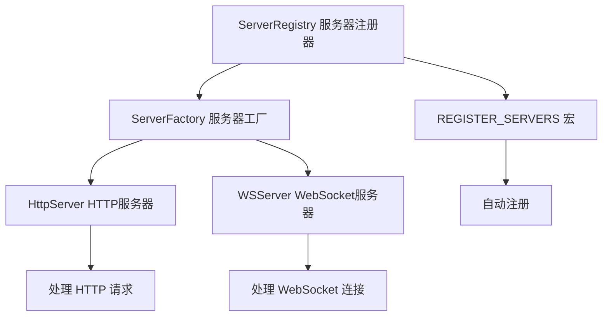

# LoNetfw 服务器组装模块架构设计

## 架构概览

```
ServerRegistry（服务器注册器 - 单例）
    │
    ├─ 注册 HTTP 服务器
    │    └─ HttpServer（处理 HTTP 请求）
    │
    ├─ 注册 WebSocket 服务器
    │    └─ WSServer（处理 WebSocket 连接）
    │
    └─ ServerFactory（服务器工厂 - 单例）
         └─ 根据配置创建服务器实例
```



---

## 1. 什么是服务器组装模块？（通俗理解）

### 1.1 用生活例子理解服务器组装

想象你开了一家餐厅：

| 角色 | 对应概念 | 作用 |
|------|---------|------|
| 餐厅经理 | ServerRegistry | 注册和管理不同类型的服务 |
| 菜谱 | ServerFactory | 根据需求创建不同的服务 |
| 普通餐桌 | HttpServer | 提供普通点餐服务 |
| VIP包间 | WSServer | 提供实时互动服务 |

**服务器组装的工作流程**：

```
餐厅开业（程序启动）
    ↓
经理登记服务（ServerRegistry 注册）
    ↓
登记普通餐桌服务（注册 HttpServer）
    ↓
登记VIP包间服务（注册 WSServer）
    ↓
顾客来了（请求到达）
    ↓
根据需求选择服务（ServerFactory 创建）
    ↓
提供相应服务（HttpServer 或 WSServer）
```

### 1.2 为什么需要服务器组装模块？

**没有服务器组装时（手动管理）**：

```cpp
// 你需要手动创建每种服务器
HttpServer* http_server = new HttpServer(...);
WSServer* ws_server = new WSServer(...);

// 问题：
// 1. 需要手动管理所有服务器
// 2. 配置分散，难以统一管理
// 3. 新增服务器类型需要修改多处代码
```

**有服务器组装时（自动管理）**：

```cpp
// 只需要注册一次，自动管理所有服务器
static auto g_server_registry = lon::util::Singleton<lon::assembly::ServerRegistry>::Instance();

// ServerRegistry 自动：
// 1. 注册所有服务器类型
// 2. 根据配置自动创建服务器
// 3. 新增服务器类型只需注册即可
```

---

## 2. 核心概念详解

### 2.1 ServerRegistry（服务器注册器）

**ServerRegistry 是什么？**

ServerRegistry 是一个单例类，负责在程序启动时注册所有服务器类型。

**核心代码**：

```cpp
class ServerRegistry
{
  public:
    ServerRegistry();
};

// 注册宏：在程序启动时自动注册
#define REGISTER_SERVERS \
    static auto g_server_registry = lon::util::Singleton<lon::assembly::ServerRegistry>::Instance();
```

**注册过程**：

```cpp
ServerRegistry::ServerRegistry()
{
    auto &factory = server::ServerFactory::Instance();
    
    // 注册 HTTP 服务器
    factory.registerServer("http", [](scheduler::IOScheduler *scheduler,
                                      scheduler::IOScheduler *accept_scheduler,
                                      const config::ConfigServer &config_server) {
        return std::make_shared<httpservice::HttpServer>(
            scheduler, accept_scheduler, 
            G_CONFIG.config_tcp_server_client_timeout->getData(),
            config_server.name, config_server.keepalive);
    });
    
    // 注册 WebSocket 服务器
    factory.registerServer("ws", [](scheduler::IOScheduler *scheduler,
                                    scheduler::IOScheduler *accept_scheduler,
                                    const config::ConfigServer &config_server) {
        return std::make_shared<ws::WSServer>(
            scheduler, accept_scheduler,
            G_CONFIG.config_tcp_server_client_timeout->getData(),
            config_server.name);
    });
}
```

### 2.2 ServerFactory（服务器工厂）

**ServerFactory 是什么？**

ServerFactory 是一个工厂模式的单例，负责根据配置创建服务器实例。

**工作流程**：

```
配置文件（config.yaml）
    ↓
读取服务器配置
    ↓
ServerFactory 根据类型查找
    ↓
调用注册的创建函数
    ↓
创建服务器实例
    ↓
启动服务器
```

**示例**：

```yaml
# 配置文件示例
servers:
  - name: "http_server"
    type: "http"  # ← ServerFactory 根据这个查找
    port: 8080
    keepalive: true
    
  - name: "ws_server"
    type: "ws"    # ← ServerFactory 根据这个查找
    port: 9000
```

### 2.3 REGISTER_SERVERS 宏

**宏的作用**：

这个宏用于在程序启动时自动注册所有服务器类型。

**使用方法**：

```cpp
// main.cpp 中
int main() {
    // 使用宏注册服务器
    REGISTER_SERVERS;
    
    // 启动应用
    lon::system::Application app;
    app.run();
    
    return 0;
}
```

**宏展开后**：

```cpp
// REGISTER_SERVERS 展开后
static auto g_server_registry = lon::util::Singleton<lon::assembly::ServerRegistry>::Instance();

// 这会：
// 1. 创建 ServerRegistry 单例
// 2. 在构造函数中注册所有服务器类型
// 3. 自动调用 ServerFactory::registerServer()
```

---

## 3. 核心代码详解

### 3.1 服务器注册过程

```cpp
ServerRegistry::ServerRegistry()
{
    // 获取工厂单例
    auto &factory = server::ServerFactory::Instance();
    
    // 注册 HTTP 服务器
    factory.registerServer("http", [](...) {
        return std::make_shared<httpservice::HttpServer>(...);
    });
    
    // 注册 WebSocket 服务器
    factory.registerServer("ws", [](...) {
        return std::make_shared<ws::WSServer>(...);
    });
}
```

**注册流程**：

```
ServerRegistry 构造函数
    ↓
获取 ServerFactory 单例
    ↓
调用 registerServer("http", ...)
    ↓
ServerFactory 内部保存映射：
    m_creators["http"] = [](...) { return HttpServer... }
    ↓
调用 registerServer("ws", ...)
    ↓
ServerFactory 内部保存映射：
    m_creators["ws"] = [](...) { return WSServer... }
```

### 3.2 服务器创建过程（假设）

```cpp
// ServerFactory 内部（假设代码）
class ServerFactory {
    std::unordered_map<std::string, CreatorFunc> m_creators;
    
    void registerServer(const std::string& type, CreatorFunc func) {
        m_creators[type] = func;  // 保存创建函数
    }
    
    Server::Ptr createServer(const std::string& type, ...) {
        auto it = m_creators.find(type);
        if (it != m_creators.end()) {
            return it->second(...);  // 调用创建函数
        }
        return nullptr;
    }
};
```

**创建流程**：

```
读取配置：type = "http"
    ↓
ServerFactory::createServer("http", ...)
    ↓
查找 m_creators["http"]
    ↓
调用保存的创建函数
    ↓
创建 HttpServer 实例
    ↓
返回服务器指针
```

---

## 4. 使用示例

### 4.1 基础使用

```cpp
#include "assembly/serverregistry.h"

int main() {
    // 步骤1: 注册所有服务器类型
    REGISTER_SERVERS;
    
    // 步骤2: 启动应用（会自动读取配置并创建服务器）
    lon::system::Application app;
    app.run();
    
    return 0;
}
```

### 4.2 添加新的服务器类型

```cpp
// 假设你要添加一个 FTP 服务器

// 步骤1: 实现 FTPServer 类
class FTPServer : public server::TcpServer {
    // ...
};

// 步骤2: 在 ServerRegistry 中注册
ServerRegistry::ServerRegistry()
{
    auto &factory = server::ServerFactory::Instance();
    
    // 注册现有服务器
    factory.registerServer("http", ...);
    factory.registerServer("ws", ...);
    
    // 注册新的 FTP 服务器
    factory.registerServer("ftp", [](...) {
        return std::make_shared<FTPServer>(...);
    });
}

// 步骤3: 在配置文件中使用
servers:
  - name: "ftp_server"
    type: "ftp"  # ← 新类型
    port: 21
```

---

## 5. 架构设计优势

### 5.1 解耦设计

```
配置文件（config.yaml）
    ↓
ServerFactory（工厂）
    ↓
ServerRegistry（注册器）
    ↓
具体服务器（HttpServer/WSServer）

每层职责清晰，互不干扰
```

### 5.2 易于扩展

**新增服务器类型只需 3 步**：

1. 实现新服务器类
2. 在 ServerRegistry 注册
3. 配置文件中使用

**不需要修改**：
- ServerFactory 代码
- Application 代码
- 其他服务器代码

### 5.3 统一管理

```
所有服务器类型都在 ServerRegistry 中注册
    ↓
配置文件统一管理所有服务器
    ↓
ServerFactory 统一创建所有服务器
    ↓
便于监控、维护、扩展
```

---

## 6. 常见问题解答

### Q1: 为什么使用宏 REGISTER_SERVERS？

**答**：宏简化了注册过程，确保在程序启动时自动注册。

```cpp
// 不使用宏（繁琐）
static lon::assembly::ServerRegistry* g_server_registry = 
    &lon::util::Singleton<lon::assembly::ServerRegistry>::Instance();

// 使用宏（简洁）
REGISTER_SERVERS;
```

### Q2: ServerRegistry 是单例吗？

**答**：是的，通过 `Singleton<ServerRegistry>::Instance()` 获取单例。

```cpp
// 单例保证：
// 1. 全局只有一个 ServerRegistry
// 2. 所有服务器类型只注册一次
// 3. 避免重复注册
```

### Q3: 如何查看已注册的服务器类型？

**答**：通过 ServerFactory 查询（假设有接口）。

```cpp
auto& factory = server::ServerFactory::Instance();
auto types = factory.getRegisteredTypes();  // 返回 ["http", "ws", ...]
```

### Q4: 配置文件中的 type 必须匹配注册的类型吗？

**答**：是的，必须完全匹配。

```yaml
# 错误：type 未注册
servers:
  - type: "ftp"  # ← 如果没有注册 ftp，会创建失败

# 正确：type 已注册
servers:
  - type: "http"  # ← 已在 ServerRegistry 注册
```

---

## 7. 总结

### assembly 模块的本质

**服务器组装模块 = 服务器类型的注册和管理系统**

- 注册：登记所有服务器类型
- 管理：统一管理服务器配置
- 创建：根据配置自动创建服务器

### 核心组件

| 组件 | 作用 |
|------|------|
| ServerRegistry | 注册所有服务器类型 |
| ServerFactory | 根据类型创建服务器实例 |
| REGISTER_SERVERS | 自动注册宏 |

### 设计优势

1. **解耦**：配置、注册、创建分离
2. **扩展**：新增服务器类型简单
3. **统一**：所有服务器统一管理
4. **自动**：启动时自动注册和创建

### 配合其他模块

assembly 模块是顶层组装模块，配合：
- **http 模块**：HTTP 协议解析
- **httpservice 模块**：HTTP 服务器实现
- **websocket 模块**：WebSocket 服务器实现
- **server 模块**：服务器工厂和基础类

详见各模块的 README.md。