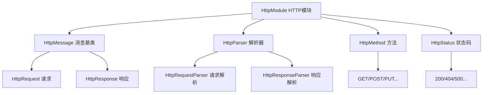

# LoNetfw HTTP 协议模块架构设计

## 架构概览

```
HttpModule（HTTP 协议模块）
    │
    ├─ HttpMessage（HTTP 消息基类）
    │    ├─ HttpRequest（HTTP 请求）
    │    └─ HttpResponse（HTTP 响应）
    │
    ├─ HttpParser（HTTP 解析器）
    │    ├─ HttpRequestParser（请求解析器）
    │    └─ HttpResponseParser（响应解析器）
    │
    ├─ HttpMethod（HTTP 方法）
    │    └─ GET/POST/PUT/DELETE/HEAD/OPTIONS...
    │
    └─ HttpStatus（HTTP 状态码）
         └─ 200/404/500/301/302...
```



---

## 1. 什么是 HTTP 协议模块？（通俗理解）

### 1.1 用生活例子理解 HTTP 协议

想象你在餐厅点餐：

| 场景 | HTTP 概念 | 说明 |
|------|----------|------|
| 顾客点餐 | HTTP Request | 顾客告诉服务员要什么 |
| 服务员记录 | HttpMethod | 点餐方式（GET=看菜单，POST=下单） |
| 菜品描述 | HttpBody | 详细内容（如"红烧肉，不要辣椒"） |
| 厨师回复 | HTTP Response | 厨师告诉顾客结果 |
| 回复状态 | HttpStatus | 结果状态（200=成功，404=没有这道菜） |

**HTTP 协议的工作流程**：

```
顾客（客户端）发送请求
    ↓
请求内容：我要红烧肉（HttpRequest）
    ↓
请求方法：POST（下单）
    ↓
请求体：红烧肉，不要辣椒（Body）
    ↓
服务员（服务器）接收请求
    ↓
厨师处理请求
    ↓
返回响应：好的，马上做（HttpResponse）
    ↓
响应状态：200 OK（成功）
    ↓
响应体：红烧肉已下单（Body）
```

### 1.2 HTTP 协议的核心组成

**HTTP 协议 = 请求 + 响应**

| 组成部分 | 说明 | 示例 |
|---------|------|------|
| **请求行** | 方法 + URL + 版本 | `POST /order HTTP/1.1` |
| **请求头** | 元信息 | `Content-Type: application/json` |
| **请求体** | 实际数据 | `{"dish": "红烧肉"}` |
| **状态行** | 版本 + 状态码 + 描述 | `HTTP/1.1 200 OK` |
| **响应头** | 元信息 | `Content-Type: text/html` |
| **响应体** | 实际数据 | `<html>...</html>` |

---

## 2. 核心概念详解

### 2.1 HttpMessage（HTTP 消息基类）

**HttpMessage 是什么？**

HttpMessage 是 HttpRequest 和 HttpResponse 的基类，包含 HTTP 消息的公共部分。

**核心成员**：

```cpp
class HttpMessage
{
  protected:
    uint8_t m_version;           // HTTP 版本（0x11 = HTTP/1.1）
    bool m_close;                // 是否关闭连接
    bool m_is_websocket;         // 是否 WebSocket
    std::string m_body;          // 消息体
    MapType m_headers;           // 头部字段
    MapType m_cookies;           // Cookie
};
```

**公共方法**：

```cpp
// 获取/设置版本
uint8_t getVersion() const;
void setVersion(uint8_t version);

// 获取/设置头部
std::string getHeader(const std::string &key, const std::string &default_value = "");
void setHeader(const std::string &key, const std::string &value);

// 获取/设置 Cookie
std::string getCookie(const std::string &key, const std::string &default_value = "");
void setCookie(const std::string &key, const std::string &value);

// 获取/设置消息体
const std::string &getBody() const;
void setBody(const std::string &body);
```

### 2.2 HttpRequest（HTTP 请求）

**HttpRequest 是什么？**

HttpRequest 表示 HTTP 请求，继承自 HttpMessage，增加请求特有的字段。

**核心字段**：

```cpp
class HttpRequest : public HttpMessage
{
  private:
    HttpMethod m_method;         // 请求方法（GET/POST/PUT...）
    std::string m_path;          // 请求路径（/api/user）
    std::string m_query;         // 查询参数（?id=123&name=test）
    std::string m_fragment;      // 片段（#section1）
};
```

**请求示例**：

```
POST /api/user?id=123 HTTP/1.1
Host: example.com
Content-Type: application/json
Content-Length: 25

{"name": "张三", "age": 25}
```

**解析后**：

```cpp
HttpRequest req;
req.getMethod()      == HttpMethod::POST
req.getPath()        == "/api/user"
req.getQuery()       == "id=123"
req.getHeader("Host") == "example.com"
req.getBody()        == "{\"name\": \"张三\", \"age\": 25}"
```

### 2.3 HttpResponse（HTTP 响应）

**HttpResponse 是什么？**

HttpResponse 表示 HTTP 响应，继承自 HttpMessage，增加响应特有的字段。

**核心字段**：

```cpp
class HttpResponse : public HttpMessage
{
  private:
    HttpStatus m_status;         // 状态码（200/404/500...）
    std::string m_reason;        // 状态描述（OK/Not Found）
};
```

**响应示例**：

```
HTTP/1.1 200 OK
Content-Type: application/json
Content-Length: 15

{"code": 200}
```

**解析后**：

```cpp
HttpResponse res;
res.getStatus()      == HttpStatus::OK
res.getHeader("Content-Type") == "application/json"
res.getBody()        == "{\"code\": 200}"
```

### 2.4 HttpMethod（HTTP 方法）

**HTTP 方法是什么？**

HTTP 方法表示请求的操作类型。

| 方法 | 作用 | 示例 |
|------|------|------|
| **GET** | 获取资源 | 获取用户信息 |
| **POST** | 创建资源 | 创建新用户 |
| **PUT** | 更新资源 | 更新用户信息 |
| **DELETE** | 删除资源 | 删除用户 |
| **HEAD** | 获取头部 | 只获取响应头 |
| **OPTIONS** | 获取选项 | 查询支持的方法 |

**代码示例**：

```cpp
// 获取方法
HttpMethod method = req.getMethod();

// 判断方法
if (method == HttpMethod::GET) {
    // 处理 GET 请求
} else if (method == HttpMethod::POST) {
    // 处理 POST 请求
}

// 设置方法
req.setMethod(HttpMethod::POST);
```

### 2.5 HttpStatus（HTTP 状态码）

**HTTP 状态码是什么？**

HTTP 状态码表示响应的结果状态。

| 状态码 | 类别 | 说明 | 示例 |
|--------|------|------|------|
| **1xx** | 信息 | 请求正在处理 | 100 Continue |
| **2xx** | 成功 | 请求成功 | 200 OK, 201 Created |
| **3xx** | 重定向 | 需要进一步操作 | 301 Moved, 302 Found |
| **4xx** | 客户端错误 | 请求有误 | 400 Bad Request, 404 Not Found |
| **5xx** | 服务器错误 | 服务器出错 | 500 Internal Error |

**代码示例**：

```cpp
// 设置状态码
res.setStatus(HttpStatus::OK);        // 200
res.setStatus(HttpStatus::NOT_FOUND); // 404
res.setStatus(HttpStatus::INTERNAL_SERVER_ERROR); // 500

// 获取状态码
HttpStatus status = res.getStatus();
```

---

## 3. HTTP 解析器详解

### 3.1 HttpParser（解析器基类）

**HttpParser 是什么？**

HttpParser 是 HTTP 解析器的基类，提供解析 HTTP 消息的公共接口。

**核心方法**：

```cpp
class HttpParser
{
  public:
    // 执行解析
    virtual ssize_t execute(char *data, size_t len, bool chunk = false) = 0;
    
    // 是否完成
    virtual int32_t finished() = 0;
    
    // 是否出错
    virtual int32_t error() = 0;
    
    // 获取解析结果
    HttpMessage::Ptr getData() const;
};
```

### 3.2 HttpRequestParser（请求解析器）

**HttpRequestParser 是什么？**

HttpRequestParser 用于解析 HTTP 请求。

**解析流程**：

```
接收数据：POST /api/user HTTP/1.1...
    ↓
HttpRequestParser::execute(data, len)
    ↓
解析请求行：POST /api/user HTTP/1.1
    ↓
解析请求头：Host: example.com
    ↓
解析请求体：{"name": "张三"}
    ↓
返回 HttpRequest 对象
```

**代码示例**：

```cpp
HttpRequestParser parser;
char data[] = "POST /api/user HTTP/1.1\r\nHost: example.com\r\n\r\n{\"name\": \"张三\"}";

ssize_t parsed = parser.execute(data, strlen(data));
if (parsed > 0 && !parser.error()) {
    HttpRequest::Ptr req = std::dynamic_pointer_cast<HttpRequest>(parser.getData());
    std::cout << "Method: " << req->getMethod() << std::endl;
    std::cout << "Path: " << req->getPath() << std::endl;
}
```

### 3.3 HttpResponseParser（响应解析器）

**HttpResponseParser 是什么？**

HttpResponseParser 用于解析 HTTP 响应。

**解析流程**：

```
接收数据：HTTP/1.1 200 OK\r\n...
    ↓
HttpResponseParser::execute(data, len)
    ↓
解析状态行：HTTP/1.1 200 OK
    ↓
解析响应头：Content-Type: application/json
    ↓
解析响应体：{"code": 200}
    ↓
返回 HttpResponse 对象
```

**代码示例**：

```cpp
HttpResponseParser parser;
char data[] = "HTTP/1.1 200 OK\r\nContent-Type: application/json\r\n\r\n{\"code\": 200}";

ssize_t parsed = parser.execute(data, strlen(data));
if (parsed > 0 && !parser.error()) {
    HttpResponse::Ptr res = std::dynamic_pointer_cast<HttpResponse>(parser.getData());
    std::cout << "Status: " << res->getStatus() << std::endl;
    std::cout << "Body: " << res->getBody() << std::endl;
}
```

### 3.4 mongrel2-http11 解析器

**底层解析库**：

LoNetfw 使用 mongrel2-http11 作为底层 HTTP 解析库，这是一个高性能的 HTTP 解析器。

**特点**：
- 高性能：使用状态机解析
- 低内存：流式解析，不需要缓存全部数据
- 标准：完全符合 HTTP/1.1 标准

---

## 4. 核心代码详解

### 4.1 HttpMessage 实现

```cpp
HttpMessage::HttpMessage(uint8_t version, bool close)
    : m_version(version), m_close(close), m_is_websocket(false)
{
}

// 设置头部
void HttpMessage::setHeader(const std::string &key, const std::string &value)
{
    m_headers[key] = value;
}

// 获取头部（带默认值）
std::string HttpMessage::getHeader(const std::string &key, const std::string &default_value)
{
    auto it = m_headers.find(key);
    if (it != m_headers.end()) {
        return it->second;
    }
    return default_value;
}

// 模板方法：类型转换获取头部
template <typename T>
T HttpMessage::getHeader(const std::string &key, const T &default_value)
{
    std::string val = getHeader(key);
    if (!val.empty()) {
        return util::lexical_cast<T>(val);
    }
    return default_value;
}
```

### 4.2 HttpRequest 实现

```cpp
// 获取查询参数
std::string HttpRequest::getParam(const std::string &key)
{
    // 解析查询字符串：?id=123&name=test
    auto params = parseQuery(m_query);
    auto it = params.find(key);
    if (it != params.end()) {
        return it->second;
    }
    return "";
}

// 转换为字符串
std::string HttpRequest::toString() const
{
    std::stringstream ss;
    // 请求行：POST /api/user?id=123 HTTP/1.1
    ss << methodToString(m_method) << " " << m_path;
    if (!m_query.empty()) {
        ss << "?" << m_query;
    }
    ss << " HTTP/" << (m_version >> 4) << "." << (m_version & 0x0F) << "\r\n";
    
    // 请求头
    for (auto &header : m_headers) {
        ss << header.first << ": " << header.second << "\r\n";
    }
    
    // 空行
    ss << "\r\n";
    
    // 请求体
    if (!m_body.empty()) {
        ss << m_body;
    }
    
    return ss.str();
}
```

### 4.3 HttpResponse 实现

```cpp
// 设置状态码
void HttpResponse::setStatus(HttpStatus status)
{
    m_status = status;
    m_reason = statusToString(status);
}

// 转换为字符串
std::string HttpResponse::toString() const
{
    std::stringstream ss;
    // 状态行：HTTP/1.1 200 OK
    ss << "HTTP/" << (m_version >> 4) << "." << (m_version & 0x0F) << " "
       << static_cast<int>(m_status) << " " << m_reason << "\r\n";
    
    // 响应头
    for (auto &header : m_headers) {
        ss << header.first << ": " << header.second << "\r\n";
    }
    
    // 空行
    ss << "\r\n";
    
    // 响应体
    if (!m_body.empty()) {
        ss << m_body;
    }
    
    return ss.str();
}
```

---

## 5. 使用示例

### 5.1 创建 HTTP 请求

```cpp
#include "http/httprequest.h"

void create_http_request() {
    // 创建请求
    http::HttpRequest::Ptr req(new http::HttpRequest());
    
    // 设置请求方法和路径
    req->setMethod(http::HttpMethod::POST);
    req->setPath("/api/user");
    req->setQuery("id=123&action=update");
    
    // 设置头部
    req->setHeader("Host", "example.com");
    req->setHeader("Content-Type", "application/json");
    req->setHeader("User-Agent", "LoNetfw/1.0");
    
    // 设置消息体
    req->setBody("{\"name\": \"张三\", \"age\": 25}");
    
    // 转换为字符串（用于发送）
    std::string request_str = req->toString();
    std::cout << request_str << std::endl;
}
```

### 5.2 创建 HTTP 响应

```cpp
#include "http/httpresponse.h"

void create_http_response() {
    // 创建响应
    http::HttpResponse::Ptr res(new http::HttpResponse());
    
    // 设置状态码
    res->setStatus(http::HttpStatus::OK);
    
    // 设置头部
    res->setHeader("Content-Type", "application/json");
    res->setHeader("Server", "LoNetfw/1.0");
    
    // 设置消息体
    res->setBody("{\"code\": 200, \"msg\": \"success\"}");
    
    // 转换为字符串（用于发送）
    std::string response_str = res->toString();
    std::cout << response_str << std::endl;
}
```

### 5.3 解析 HTTP 请求

```cpp
#include "http/httpparser.h"

void parse_http_request() {
    // 创建解析器
    http::HttpRequestParser::Ptr parser(new http::HttpRequestParser());
    
    // 接收到的数据
    char data[] = "GET /api/user?id=123 HTTP/1.1\r\n"
                  "Host: example.com\r\n"
                  "User-Agent: LoNetfw/1.0\r\n"
                  "\r\n";
    
    // 解析数据
    ssize_t parsed = parser->execute(data, strlen(data));
    
    if (parsed > 0 && !parser->error()) {
        // 获取解析结果
        http::HttpRequest::Ptr req = 
            std::dynamic_pointer_cast<http::HttpRequest>(parser->getData());
        
        // 使用解析结果
        std::cout << "Method: " << req->getMethod() << std::endl;
        std::cout << "Path: " << req->getPath() << std::endl;
        std::cout << "Query: " << req->getQuery() << std::endl;
        std::cout << "Host: " << req->getHeader("Host") << std::endl;
    }
}
```

### 5.4 解析 HTTP 响应

```cpp
#include "http/httpparser.h"

void parse_http_response() {
    // 创建解析器
    http::HttpResponseParser::Ptr parser(new http::HttpResponseParser());
    
    // 接收到的数据
    char data[] = "HTTP/1.1 200 OK\r\n"
                  "Content-Type: application/json\r\n"
                  "Server: LoNetfw/1.0\r\n"
                  "\r\n"
                  "{\"code\": 200}";
    
    // 解析数据
    ssize_t parsed = parser->execute(data, strlen(data));
    
    if (parsed > 0 && !parser->error()) {
        // 获取解析结果
        http::HttpResponse::Ptr res = 
            std::dynamic_pointer_cast<http::HttpResponse>(parser->getData());
        
        // 使用解析结果
        std::cout << "Status: " << res->getStatus() << std::endl;
        std::cout << "Content-Type: " << res->getHeader("Content-Type") << std::endl;
        std::cout << "Body: " << res->getBody() << std::endl;
    }
}
```

---

## 6. HTTP 协议细节

### 6.1 HTTP 版本

| 版本 | 说明 | 特点 |
|------|------|------|
| **HTTP/1.0** | 早期版本 | 每次请求新建连接 |
| **HTTP/1.1** | 当前主流 | 支持持久连接（Keep-Alive） |
| **HTTP/2.0** | 新版本 | 多路复用、头部压缩 |

**代码中的版本表示**：

```cpp
// 0x11 = HTTP/1.1
uint8_t version = 0x11;

// 解析版本号
int major = version >> 4;  // 1
int minor = version & 0x0F; // 1
```

### 6.2 HTTP 头部

**常用头部**：

| 头部 | 作用 | 示例 |
|------|------|------|
| **Host** | 目标主机 | `example.com` |
| **Content-Type** | 内容类型 | `application/json` |
| **Content-Length** | 内容长度 | `1024` |
| **User-Agent** | 客户端信息 | `Mozilla/5.0` |
| **Accept** | 接受的类型 | `text/html` |
| **Cookie** | Cookie | `session=abc123` |

**代码示例**：

```cpp
// 设置 Content-Type
req->setHeader("Content-Type", "application/json");

// 获取 Content-Length
int length = req->getHeader<int>("Content-Length", 0);
```

### 6.3 HTTP 消息体

**消息体类型**：

| Content-Type | 说明 | 示例 |
|--------------|------|------|
| `text/html` | HTML 文本 | `<html>...</html>` |
| `application/json` | JSON 数据 | `{"code": 200}` |
| `application/xml` | XML 数据 | `<xml>...</xml>` |
| `multipart/form-data` | 表单上传 | 文件上传 |
| `application/octet-stream` | 二进制流 | 文件下载 |

---

## 7. 常见问题解答

### Q1: 如何处理查询参数？

**答**：使用 `getParam()` 方法。

```cpp
// 请求：GET /api/user?id=123&name=test

// 获取参数
std::string id = req->getParam("id");    // "123"
std::string name = req->getParam("name"); // "test"

// 参数不存在时返回空字符串
std::string age = req->getParam("age");  // ""
```

### Q2: 如何处理 Cookie？

**答**：使用 `getCookie()` 和 `setCookie()` 方法。

```cpp
// 获取 Cookie
std::string session = req->getCookie("session");

// 设置 Cookie
res->setCookie("session", "abc123");
res->setHeader("Set-Cookie", "session=abc123; Path=/; HttpOnly");
```

### Q3: 如何处理大文件上传？

**答**：使用流式解析，避免一次性读取全部数据。

```cpp
// 分块解析
char buffer[4096];
while (true) {
    int n = recv(socket, buffer, sizeof(buffer));
    if (n <= 0) break;
    
    ssize_t parsed = parser->execute(buffer, n, true);  // chunk=true
    if (parser->finished()) {
        // 解析完成
        break;
    }
}
```

### Q4: 如何支持 HTTPS？

**答**：在 httpservice 模块中处理，http 模块只负责协议解析。

```cpp
// httpservice 模块会处理 SSL/TLS
// http 模块只解析 HTTP 协议本身
```

---

## 8. 总结

### HTTP 模块的本质

**HTTP 模块 = HTTP 协议的解析和封装**

- 解析：将字节流解析为结构化数据
- 封装：将结构化数据封装为字节流

### 核心组件

| 组件 | 作用 |
|------|------|
| HttpMessage | HTTP 消息基类 |
| HttpRequest | HTTP 请求封装 |
| HttpResponse | HTTP 响应封装 |
| HttpParser | HTTP 协议解析 |
| HttpMethod | HTTP 方法定义 |
| HttpStatus | HTTP 状态码定义 |

### 设计优势

1. **标准**：完全符合 HTTP/1.1 标准
2. **高效**：使用高性能解析器
3. **易用**：简洁的 API 接口
4. **灵活**：支持各种 HTTP 特性

### 配合其他模块

HTTP 模块是基础协议模块，配合：
- **httpservice 模块**：HTTP 服务器实现
- **websocket 模块**：WebSocket 协议（基于 HTTP）
- **assembly 模块**：服务器组装

详见各模块的 README.md。