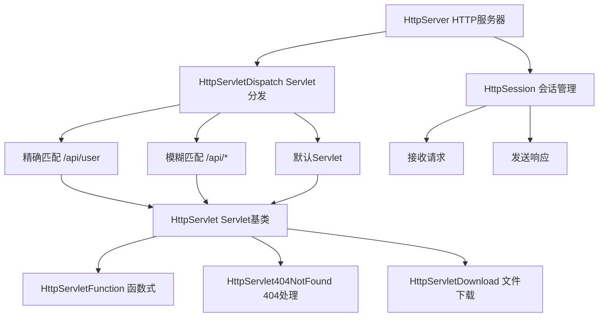

# LoNetfw HTTP 服务模块架构设计

## 架构概览

```
HttpServer（HTTP 服务器）
    │
    ├─ HttpSession（HTTP 会话）
    │    ├─ 接收 HTTP 请求
    │    └─ 发送 HTTP 响应
    │
    ├─ HttpServletDispatch（Servlet 分发器）
    │    ├─ 精确匹配（/api/user）
    │    ├─ 模糊匹配（/api/*）
    │    └─ 默认 Servlet
    │
    ├─ HttpServlet（Servlet 基类）
    │    ├─ HttpServletFunction（函数式 Servlet）
    │    ├─ HttpServlet404NotFound（404 Servlet）
    │    └─ HttpServletDownload（下载 Servlet）
    │
    └─ HttpConnection（HTTP 连接）
         └─ 管理客户端连接
```



---

## 1. 什么是 HTTP 服务模块？（通俗理解）

### 1.1 用生活例子理解 HTTP 服务

想象一个餐厅的服务流程：

| 角色 | 对应概念 | 作用 |
|------|---------|------|
| 餐厅 | HttpServer | 整个餐厅系统 |
| 服务员 | HttpSession | 接待顾客，传递请求和响应 |
| 菜谱分发 | HttpServletDispatch | 根据订单类型分发到不同厨师 |
| 厨师 | HttpServlet | 处理具体订单 |
| 普通厨师 | HttpServletFunction | 处理普通订单 |
| 专门厨师 | HttpServletDownload | 处理外卖打包 |

**HTTP 服务的工作流程**：

```
顾客进店（客户端连接）
    ↓
服务员接待（HttpSession 创建）
    ↓
顾客点餐（接收 HTTP 请求）
    ↓
服务员传递订单（HttpSession.recvRequest）
    ↓
分发到厨师（HttpServletDispatch.getServlet）
    ↓
厨师处理订单（HttpServlet.handle）
    ↓
厨师返回菜品（生成 HTTP 响应）
    ↓
服务员传递给顾客（HttpSession.sendResponse）
    ↓
顾客离开或继续点餐（连接关闭或 Keep-Alive）
```

### 1.2 Servlet 模式（核心概念）

**什么是 Servlet？**

Servlet = "服务器小程序"，用于处理特定的 HTTP 请求。

**类比**：

```
餐厅菜单：
├─ 红烧肉 → 厨师A（Servlet_A）
├─ 炒青菜 → 厨师B（Servlet_B）
├─ 米饭   → 厧师C（Servlet_C）
└─ 其他   → 厨师D（DefaultServlet）

顾客点"红烧肉" → 分发到厨师A
顾客点"炒青菜" → 分发到厨师B
顾客点"未知菜品" → 分发到厨师D（默认）
```

---

## 2. 核心概念详解

### 2.1 HttpServer（HTTP 服务器）

**HttpServer 是什么？**

HttpServer 是 HTTP 服务器的主类，继承自 TcpServer，负责监听端口、接受连接、分发请求。

**核心成员**：

```cpp
class HttpServer : public server::TcpServer
{
  private:
    bool m_keepalive;                    // 是否支持 Keep-Alive
    HttpServletDispatch::Ptr m_dispatch; // Servlet 分发器
};
```

**核心方法**：

```cpp
// 处理客户端连接
void handleClient(const net::Socket::Ptr &client) override;

// 设置分发器
void setDispatch(const HttpServletDispatch::Ptr &dispatch);

// 获取分发器
HttpServletDispatch::Ptr getDispatch();
```

**工作流程**：

```
监听端口（8080）
    ↓
接受连接（accept）
    ↓
创建 HttpSession
    ↓
接收请求（recvRequest）
    ↓
分发到 Servlet（dispatch.getServlet）
    ↓
Servlet 处理请求（handle）
    ↓
发送响应（sendResponse）
    ↓
判断 Keep-Alive
    ├─ 是 → 继续接收下一个请求
    └─ 否 → 关闭连接
```

### 2.2 HttpSession（HTTP 会话）

**HttpSession 是什么？**

HttpSession 表示一个 HTTP 会话，负责接收请求和发送响应。

**核心成员**：

```cpp
class HttpSession : public net::SocketStream
{
  private:
    size_t m_buffer_size;  // 缓冲区大小
};
```

**核心方法**：

```cpp
// 接收 HTTP 请求
http::HttpRequest::Ptr recvRequest();

// 发送 HTTP 响应
ssize_t sendResponse(const http::HttpResponse::Ptr &response);
```

**接收请求流程**：

```
读取数据（recv）
    ↓
解析 HTTP 请求（HttpRequestParser）
    ↓
返回 HttpRequest 对象
```

**发送响应流程**：

```
生成响应字符串（response.toString）
    ↓
发送数据（send）
    ↓
返回发送字节数
```

### 2.3 HttpServlet（Servlet 基类）

**HttpServlet 是什么？**

HttpServlet 是所有 Servlet 的基类，定义了处理 HTTP 请求的接口。

**核心方法**：

```cpp
class HttpServlet
{
  public:
    // 处理 HTTP 请求（必须实现）
    virtual int32_t handle(
        const http::HttpRequest::Ptr &req,
        const http::HttpResponse::Ptr &res,
        const HttpSession::Ptr &session
    ) = 0;
    
    // 获取 Servlet 名称
    const std::string &getName() const;
};
```

**Servlet 类型**：

| Servlet 类型 | 作用 | 使用场景 |
|-------------|------|---------|
| HttpServletFunction | 函数式 Servlet | 简单请求处理 |
| HttpServlet404NotFound | 404 处理 | 资源不存在 |
| HttpServletDownload | 文件下载 | 文件下载服务 |
| HttpServletDispatch | 分发 Servlet | 请求分发 |

### 2.4 HttpServletDispatch（Servlet 分发器）

**HttpServletDispatch 是什么？**

HttpServletDispatch 是 Servlet 分发器，根据 URL 路径分发到不同的 Servlet。

**核心成员**：

```cpp
class HttpServletDispatch : public HttpServlet
{
  private:
    // 精确匹配：/api/user → Servlet
    std::unordered_map<std::string, HttpServlet::Ptr> m_servlets;
    
    // 模糊匹配：/api/* → Servlet
    std::vector<std::pair<std::string, HttpServlet::Ptr>> m_glob_servlets;
    
    // 默认 Servlet（所有路径都没匹配时）
    HttpServlet::Ptr m_default_servlet;
};
```

**核心方法**：

```cpp
// 添加精确 Servlet
void addServlet(const std::string &uri, const HttpServlet::Ptr &servlet);

// 添加函数式 Servlet（简化）
void addServlet(const std::string &uri, HttpServletFunction::callback cb);

// 添加模糊 Servlet
void addGlobServlet(const std::string &uri, const HttpServlet::Ptr &servlet);

// 获取 Servlet（核心方法）
HttpServlet::Ptr getServlet(const std::string &uri);
```

**分发逻辑**：

```cpp
HttpServlet::Ptr getServlet(const std::string &uri)
{
    // 1. 精确匹配
    auto it = m_servlets.find(uri);
    if (it != m_servlets.end()) {
        return it->second;
    }
    
    // 2. 模糊匹配
    for (auto &pair : m_glob_servlets) {
        if (uri.find(pair.first) == 0) {  // 前缀匹配
            return pair.second;
        }
    }
    
    // 3. 默认 Servlet
    return m_default_servlet;
}
```

**匹配示例**：

```
注册 Servlet：
├─ /api/user → Servlet_A（精确）
├─ /api/*    → Servlet_B（模糊）
└─ 默认      → Servlet_C（默认）

请求路径 → 匹配结果：
├─ /api/user → Servlet_A（精确匹配）
├─ /api/order → Servlet_B（模糊匹配）
└─ /static/index.html → Servlet_C（默认）
```

### 2.5 HttpServletFunction（函数式 Servlet）

**HttpServletFunction 是什么？**

HttpServletFunction 是一个简化版的 Servlet，直接用函数处理请求。

**核心代码**：

```cpp
class HttpServletFunction : public HttpServlet
{
  public:
    using callback = std::function<int32_t(
        const http::HttpRequest::Ptr &req,
        const http::HttpResponse::Ptr &res,
        const HttpSession::Ptr &session
    )>;
    
  private:
    callback m_cb;  // 处理函数
};
```

**使用示例**：

```cpp
// 添加函数式 Servlet
dispatch->addServlet("/api/hello", [](
    const http::HttpRequest::Ptr &req,
    const http::HttpResponse::Ptr &res,
    const HttpSession::Ptr &session
) {
    res->setStatus(http::HttpStatus::OK);
    res->setBody("{\"msg\": \"Hello World\"}");
    return 0;
});
```

### 2.6 HttpServletDownload（文件下载 Servlet）

**HttpServletDownload 是什么？**

HttpServletDownload 是一个专门处理文件下载的 Servlet，支持 Range 请求（分段下载）。

**核心功能**：

| 功能 | 说明 |
|------|------|
| **文件下载** | 处理文件下载请求 |
| **Range 支持** | 支持分段下载（断点续传） |
| **MIME 类型** | 自动识别文件类型 |
| **边界处理** | 支持多文件下载 |

**Range 请求示例**：

```
请求：Range: bytes=0-1023
响应：Content-Range: bytes 0-1023/10240
      （返回文件的前 1024 字节）

请求：Range: bytes=1024-
响应：Content-Range: bytes 1024-10239/10240
      （返回文件的后半部分）
```

---

## 3. 核心代码详解

### 3.1 HttpServer 处理客户端

```cpp
void HttpServer::handleClient(const net::Socket::Ptr &client)
{
    // 创建 HttpSession
    HttpSession::Ptr session(new HttpSession(client));
    
    while (true) {
        // 接收请求
        http::HttpRequest::Ptr req = session->recvRequest();
        if (!req) {
            // 接收失败，关闭连接
            break;
        }
        
        // 创建响应
        http::HttpResponse::Ptr res(new http::HttpResponse());
        
        // 获取 Servlet
        HttpServlet::Ptr servlet = m_dispatch->getServlet(req->getPath());
        
        // Servlet 处理请求
        if (servlet) {
            servlet->handle(req, res, session);
        } else {
            // 没有 Servlet，返回 404
            res->setStatus(http::HttpStatus::NOT_FOUND);
            res->setBody("404 Not Found");
        }
        
        // 发送响应
        session->sendResponse(res);
        
        // 判断是否继续
        if (!m_keepalive || req->isClose()) {
            break;
        }
    }
    
    // 关闭连接
    client->close();
}
```

### 3.2 HttpSession 接收请求

```cpp
http::HttpRequest::Ptr HttpSession::recvRequest()
{
    // 创建解析器
    http::HttpRequestParser::Ptr parser(new http::HttpRequestParser());
    
    // 缓冲区
    char buffer[m_buffer_size];
    
    while (true) {
        // 读取数据
        ssize_t n = recv(buffer, sizeof(buffer));
        if (n <= 0) {
            return nullptr;  // 读取失败
        }
        
        // 解析数据
        ssize_t parsed = parser->execute(buffer, n);
        
        // 检查是否完成
        if (parser->finished()) {
            // 返回解析结果
            return std::dynamic_pointer_cast<http::HttpRequest>(parser->getData());
        }
        
        // 检查是否出错
        if (parser->error()) {
            return nullptr;  // 解析失败
        }
    }
}
```

### 3.3 HttpSession 发送响应

```cpp
ssize_t HttpSession::sendResponse(const http::HttpResponse::Ptr &response)
{
    // 转换为字符串
    std::string data = response->toString();
    
    // 发送数据
    return send(data.c_str(), data.size());
}
```

### 3.4 HttpServletDispatch 分发逻辑

```cpp
HttpServlet::Ptr HttpServletDispatch::getServlet(const std::string &uri)
{
    // 加读锁
    MutexType::ReadLock lock(m_mutex);
    
    // 1. 精确匹配
    auto it = m_servlets.find(uri);
    if (it != m_servlets.end()) {
        return it->second;
    }
    
    // 2. 模糊匹配（前缀匹配）
    for (auto &pair : m_glob_servlets) {
        // 检查是否前缀匹配
        if (uri.length() >= pair.first.length() &&
            uri.find(pair.first) == 0) {
            return pair.second;
        }
    }
    
    // 3. 返回默认 Servlet
    return m_default_servlet;
}
```

---

## 4. 使用示例

### 4.1 创建 HTTP 服务器

```cpp
#include "httpservice/httpserver.h"

void create_http_server() {
    // 创建 IO 调度器
    scheduler::IOScheduler::Ptr io_sched(new scheduler::IOScheduler(4, true, "http"));
    io_sched->start();
    
    // 创建 HTTP 服务器
    httpservice::HttpServer::Ptr server(new httpservice::HttpServer(
        io_sched.get(), io_sched.get(), 
        60 * 1000,  // 客户端超时 60 秒
        "http_server", 
        true  // 支持 Keep-Alive
    ));
    
    // 创建 Servlet 分发器
    httpservice::HttpServletDispatch::Ptr dispatch(new httpservice::HttpServletDispatch());
    
    // 设置分发器
    server->setDispatch(dispatch);
    
    // 绑定端口并启动
    server->bindAndListen("0.0.0.0", 8080);
    
    std::cout << "HTTP 服务器启动，监听 8080 端口" << std::endl;
}
```

### 4.2 注册 Servlet

```cpp
#include "httpservice/httpservlet.h"

void register_servlets(httpservice::HttpServletDispatch::Ptr dispatch) {
    // 注册函数式 Servlet（精确匹配）
    dispatch->addServlet("/api/hello", [](
        const http::HttpRequest::Ptr &req,
        const http::HttpResponse::Ptr &res,
        const httpservice::HttpSession::Ptr &session
    ) {
        res->setStatus(http::HttpStatus::OK);
        res->setHeader("Content-Type", "application/json");
        res->setBody("{\"msg\": \"Hello World\"}");
        return 0;
    });
    
    // 注册模糊 Servlet（前缀匹配）
    dispatch->addGlobServlet("/api/*", [](
        const http::HttpRequest::Ptr &req,
        const http::HttpResponse::Ptr &res,
        const httpservice::HttpSession::Ptr &session
    ) {
        res->setStatus(http::HttpStatus::OK);
        res->setBody("{\"msg\": \"API Handler\"}");
        return 0;
    });
    
    // 设置默认 Servlet
    dispatch->setDefaultServlet(httpservice::HttpServlet::Ptr(
        new httpservice::HttpServlet404NotFound()
    ));
}
```

### 4.3 自定义 Servlet

```cpp
#include "httpservice/httpservlet.h"

// 自定义 Servlet 类
class UserServlet : public httpservice::HttpServlet
{
  public:
    UserServlet() : HttpServlet("user_servlet") {}
    
    virtual int32_t handle(
        const http::HttpRequest::Ptr &req,
        const http::HttpResponse::Ptr &res,
        const httpservice::HttpSession::Ptr &session
    ) override {
        // 获取请求方法
        http::HttpMethod method = req->getMethod();
        
        if (method == http::HttpMethod::GET) {
            // 处理 GET 请求
            handleGet(req, res);
        } else if (method == http::HttpMethod::POST) {
            // 处理 POST 请求
            handlePost(req, res);
        } else {
            // 不支持的方法
            res->setStatus(http::HttpStatus::METHOD_NOT_ALLOWED);
        }
        
        return 0;
    }
    
  private:
    void handleGet(const http::HttpRequest::Ptr &req, const http::HttpResponse::Ptr &res) {
        // 获取查询参数
        std::string user_id = req->getParam("id");
        
        // 查询用户信息
        std::string user_info = queryUser(user_id);
        
        // 设置响应
        res->setStatus(http::HttpStatus::OK);
        res->setHeader("Content-Type", "application/json");
        res->setBody(user_info);
    }
    
    void handlePost(const http::HttpRequest::Ptr &req, const http::HttpResponse::Ptr &res) {
        // 解析请求体
        std::string body = req->getBody();
        
        // 创建用户
        std::string result = createUser(body);
        
        // 设置响应
        res->setStatus(http::HttpStatus::CREATED);
        res->setBody(result);
    }
};

// 注册自定义 Servlet
dispatch->addServlet("/api/user", httpservice::HttpServlet::Ptr(new UserServlet()));
```

### 4.4 文件下载服务

```cpp
#include "httpservice/httpservlet.h"

void setup_download_service(httpservice::HttpServletDispatch::Ptr dispatch) {
    // 创建下载 Servlet
    httpservice::HttpServletDownload::Ptr download_servlet(
        new httpservice::HttpServletDownload(true, "boundary")
    );
    
    // 注册到模糊匹配（所有 /download/* 路径）
    dispatch->addGlobServlet("/download/*", download_servlet);
    
    // 现在可以：
    // GET /download/file.txt → 下载 file.txt
    // GET /download/image.jpg → 下载 image.jpg
    // Range: bytes=0-1023 → 分段下载
}
```

---

## 5. Keep-Alive 机制详解

### 5.1 什么是 Keep-Alive？

**Keep-Alive = 持久连接**

传统 HTTP（HTTP/1.0）：
```
请求1 → 连接 → 响应1 → 断开
请求2 → 连接 → 响应2 → 断开
请求3 → 连接 → 响应3 → 断开
（每次请求都要新建连接，开销大）
```

Keep-Alive（HTTP/1.1）：
```
请求1 → 连接 → 响应1
请求2 →      → 响应2
请求3 →      → 响应3
              → 断开
（一个连接处理多个请求，开销小）
```

### 5.2 Keep-Alive 的优势

| 对比项 | 无 Keep-Alive | 有 Keep-Alive |
|--------|--------------|--------------|
| **连接次数** | 每次请求新建 | 一次连接多次请求 |
| **延迟** | 每次都有连接延迟 | 只有一次连接延迟 |
| **资源占用** | 每次占用新资源 | 资源复用 |
| **吞吐量** | 低 | 高 |

### 5.3 Keep-Alive 的实现

```cpp
// HttpServer 中
while (true) {
    // 接收请求
    HttpRequest::Ptr req = session->recvRequest();
    
    // 处理请求
    HttpServlet::Ptr servlet = dispatch->getServlet(req->getPath());
    servlet->handle(req, res, session);
    
    // 发送响应
    session->sendResponse(res);
    
    // ★ 判断是否继续 ★
    if (!m_keepalive || req->isClose()) {
        break;  // 关闭连接
    }
    
    // 否则继续接收下一个请求
}
```

---

## 6. Servlet 分发详解

### 6.1 精确匹配 vs 模糊匹配

**精确匹配**：

```cpp
// 注册
dispatch->addServlet("/api/user", servlet);

// 匹配规则：完全相等
请求路径           匹配结果
/api/user      → servlet（匹配）
/api/user/123  → 不匹配
/api/users     → 不匹配
```

**模糊匹配**：

```cpp
// 注册
dispatch->addGlobServlet("/api/*", servlet);

// 匹配规则：前缀匹配
请求路径           匹配结果
/api/user      → servlet（匹配）
/api/user/123  → servlet（匹配）
/api/order     → servlet（匹配）
/static/file   → 不匹配
```

### 6.2 匹配优先级

```
优先级：精确匹配 > 模糊匹配 > 默认 Servlet

示例：
注册：
├─ /api/user → Servlet_A（精确）
├─ /api/*    → Servlet_B（模糊）
└─ 默认      → Servlet_C

请求路径 → 匹配结果：
├─ /api/user      → Servlet_A（精确优先）
├─ /api/order     → Servlet_B（模糊匹配）
├─ /static/file   → Servlet_C（默认）
```

---

## 7. 常见问题解答

### Q1: 如何处理 POST 请求的 JSON 数据？

**答**：从请求体中解析 JSON。

```cpp
dispatch->addServlet("/api/user", [](req, res, session) {
    // 获取请求体
    std::string body = req->getBody();
    
    // 解析 JSON（使用 nlohmann/json）
    nlohmann::json json = nlohmann::json::parse(body);
    
    // 使用 JSON 数据
    std::string name = json["name"];
    int age = json["age"];
    
    // 处理...
});
```

### Q2: 如何设置响应的 Content-Type？

**答**：使用 `setHeader()` 方法。

```cpp
// JSON 响应
res->setHeader("Content-Type", "application/json");

// HTML 响应
res->setHeader("Content-Type", "text/html");

// 文件下载
res->setHeader("Content-Type", "application/octet-stream");
res->setHeader("Content-Disposition", "attachment; filename=file.txt");
```

### Q3: 如何处理跨域请求（CORS）？

**答**：设置 CORS 相关头部。

```cpp
dispatch->addServlet("/api/*", [](req, res, session) {
    // CORS 头部
    res->setHeader("Access-Control-Allow-Origin", "*");
    res->setHeader("Access-Control-Allow-Methods", "GET, POST, PUT, DELETE");
    res->setHeader("Access-Control-Allow-Headers", "Content-Type");
    
    // 处理请求...
});
```

### Q4: 如何实现文件上传？

**答**：解析 multipart/form-data 格式。

```cpp
// 文件上传 Servlet
class FileUploadServlet : public HttpServlet {
    int32_t handle(req, res, session) override {
        // 检查 Content-Type
        std::string content_type = req->getHeader("Content-Type");
        if (content_type.find("multipart/form-data") == std::string::npos) {
            res->setStatus(HttpStatus::BAD_REQUEST);
            return 0;
        }
        
        // 解析 multipart 数据
        std::string body = req->getBody();
        // 解析文件数据...
        
        // 保存文件
        saveFile(file_data, filename);
        
        // 返回结果
        res->setStatus(HttpStatus::OK);
        res->setBody("{\"msg\": \"upload success\"}");
        return 0;
    }
};
```

---

## 8. 总结

### httpservice 模块的本质

**HTTP 服务模块 = HTTP 请求处理和分发系统**

- 接收：接收 HTTP 请求
- 分发：分发到不同的 Servlet
- 处理：Servlet 处理请求
- 响应：发送 HTTP 响应

### 核心组件

| 组件 | 作用 |
|------|------|
| HttpServer | HTTP 服务器主类 |
| HttpSession | HTTP 会话管理 |
| HttpServlet | Servlet 基类 |
| HttpServletDispatch | Servlet 分发器 |
| HttpServletFunction | 函数式 Servlet |
| HttpServletDownload | 文件下载 Servlet |

### 设计优势

1. **Servlet 模式**：请求处理模块化
2. **灵活分发**：精确匹配 + 模糊匹配
3. **Keep-Alive**：支持持久连接
4. **易于扩展**：自定义 Servlet 简单

### 配合其他模块

httpservice 模块是 HTTP 服务实现模块，配合：
- **http 模块**：HTTP 协议解析
- **websocket 模块**：WebSocket 服务（继承 HttpServlet）
- **assembly 模块**：服务器组装

详见各模块的 README.md。