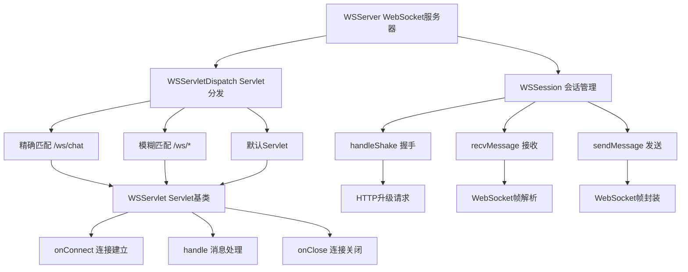

# LoNetfw WebSocket 模块架构设计

## 架构概览

```
WSServer（WebSocket 服务器）
    │
    ├─ WSSession（WebSocket 会话）
    │    ├─ handleShake（握手处理）
    │    ├─ recvMessage（接收消息）
    │    └─ sendMessage（发送消息）
    │
    ├─ WSServletDispatch（Servlet 分发器）
    │    ├─ 精确匹配（/ws/chat）
    │    ├─ 模糊匹配（/ws/*）
    │    └─ 默认 Servlet
    │
    ├─ WSServlet（Servlet 基类）
    │    ├─ onConnect（连接建立）
    │    ├─ onClose（连接关闭）
    │    └─ handle（消息处理）
    │
    └─ WebSocket（WebSocket 协议）
         ├─ WSFrameHead（帧头）
         ├─ WSFrameMessage（帧消息）
         └─ recvMessage/sendMessage（收发消息）
```



---

## 1. 什么是 WebSocket？（通俗理解）

### 1.1 WebSocket vs HTTP

**HTTP 的局限**：

```
HTTP：单向通信（客户端请求 → 服务器响应）

客户端：我要红烧肉
服务器：好的，给你红烧肉
客户端：我要炒青菜
服务器：好的，给你炒青菜
（每次都要客户端主动请求）
```

**WebSocket 的优势**：

```
WebSocket：双向通信（客户端和服务器都可以主动发送）

客户端：我要红烧肉
服务器：好的，给你红烧肉
服务器：红烧肉做好了！← 服务器主动通知
客户端：收到！
服务器：炒青菜也做好了！← 服务器主动通知
（服务器可以主动推送消息）
```

### 1.2 WebSocket 的应用场景

| 场景 | HTTP | WebSocket |
|------|------|-----------|
| **聊天应用** | 需要轮询（每隔几秒问一次） | 实时推送（有消息立即发送） |
| **股票行情** | 需要刷新页面 | 实时更新（价格变化立即推送） |
| **在线游戏** | 需要频繁请求 | 实时同步（玩家动作立即推送） |
| **协作编辑** | 需要手动保存 | 实时协作（编辑立即同步） |

**生活比喻**：

- HTTP = 写信（你发信，对方回信，来回需要时间）
- WebSocket = 打电话（双方可以随时说话，实时交流）

### 1.3 WebSocket 的工作流程

```
步骤1: HTTP 握手
─────────────────
客户端发送 HTTP 请求：
GET /ws/chat HTTP/1.1
Upgrade: websocket
Connection: Upgrade
Sec-WebSocket-Key: abc123

服务器返回 HTTP 响应：
HTTP/1.1 101 Switching Protocols
Upgrade: websocket
Connection: Upgrade
Sec-WebSocket-Accept: xyz789

（协议从 HTTP 升级为 WebSocket）


步骤2: WebSocket 通信
─────────────────
客户端发送消息：
→ 帧头 + 数据（"你好"）

服务器接收消息：
← 解析帧头 + 数据

服务器发送消息：
→ 帧头 + 数据（"收到"）

客户端接收消息：
← 解析帧头 + 数据

（双向实时通信）


步骤3: 连接关闭
─────────────────
客户端发送 CLOSE 帧：
→ opcode=8（关闭）

服务器响应 CLOSE 帧：
← opcode=8（关闭）

（连接关闭）
```

---

## 2. WebSocket 协议详解

### 2.1 WebSocket 帧格式

**WebSocket 数据帧结构**：

```
0                   1                   2                   3
0 1 2 3 4 5 6 7 8 9 0 1 2 3 4 5 6 7 8 9 0 1 2 3 4 5 6 7 8 9 0 1
+-+-+-+-+-------+-+-------------+-------------------------------+
|F|R|R|R| opcode|M| Payload len |    Extended payload length    |
|I|S|S|S|  (4)  |A|     (7)     |             (16/64)           |
|N|V|V|V|       |S|             |   (if payload len==126/127)   |
| |1|2|3|       |K|             |                               |
+-+-+-+-+-------+-+-------------+ - - - - - - - - - - - - - - - +
|     Extended payload length continued, if payload len == 127  |
+ - - - - - - - - - - - - - - - +-------------------------------+
|                               | Masking-key, if MASK set to 1 |
+-------------------------------+-------------------------------+
| Masking-key (continued)       |          Payload Data         |
+-------------------------------- - - - - - - - - - - - - - - -+
:                     Payload Data continued ...                :
+ - - - - - - - - - - - - - - - - - - - - - - - - - - - - - - - +
|                     Payload Data continued ...                |
+---------------------------------------------------------------+
```

**帧头字段说明**：

| 字段 | 大小 | 说明 |
|------|------|------|
| **FIN** | 1 bit | 是否最后一帧（1=最后一帧，0=还有后续帧） |
| **RSV1-3** | 3 bits | 保留位（扩展用） |
| **opcode** | 4 bits | 操作码（帧类型） |
| **MASK** | 1 bit | 是否掩码（客户端必须掩码） |
| **Payload len** | 7 bits | 数据长度（0-125，126=16位扩展，127=64位扩展） |
| **Masking-key** | 0/4 bytes | 掩码密钥（客户端发送时需要） |
| **Payload Data** | 变长 | 实际数据 |

### 2.2 操作码（opcode）

**opcode 定义**：

| opcode | 名称 | 说明 |
|--------|------|------|
| **0x0** | CONTINUE | 数据分片帧（后续帧） |
| **0x1** | TEXT_FRAME | 文本帧（UTF-8 文本） |
| **0x2** | BIN_FRAME | 二进制帧（二进制数据） |
| **0x8** | CLOSE | 关闭帧（关闭连接） |
| **0x9** | PING | Ping 帧（心跳检测） |
| **0xA** | PONG | Pong 帧（心跳响应） |

**代码定义**：

```cpp
struct WSFrameHead
{
    enum OPCODE
    {
        CONTINUE   = 0,    // 数据分片帧
        TEXT_FRAME = 1,    // 文本帧
        BIN_FRAME  = 2,    // 二进制帧
        CLOSE      = 8,    // 关闭帧
        PING       = 0x9,  // Ping 帧
        PONG       = 0xA   // Pong 帧
    };
    
    uint32_t opcode : 4;  // 操作码
    bool fin : 1;         // 是否最后一帧
    uint32_t payload : 7; // 数据长度
    bool mask : 1;        // 是否掩码
};
```

### 2.3 数据掩码（Masking）

**为什么需要掩码？**

WebSocket 规定：客户端发送的数据必须掩码，服务器发送的数据不掩码。

**掩码算法**：

```
原始数据：[byte0, byte1, byte2, byte3, byte4, ...]
掩码密钥：[key0, key1, key2, key3]

掩码后数据：
byte0 XOR key0
byte1 XOR key1
byte2 XOR key2
byte3 XOR key3
byte4 XOR key0  ← 循环使用密钥
byte5 XOR key1
...
```

**代码实现**：

```cpp
// 应用掩码
void applyMask(char *data, size_t len, const char *mask_key)
{
    for (size_t i = 0; i < len; ++i) {
        data[i] ^= mask_key[i % 4];  // 循环使用密钥
    }
}

// 发送时（客户端）
char mask_key[4] = {0x12, 0x34, 0x56, 0x78};
applyMask(data, len, mask_key);

// 接收时（服务器）
applyMask(data, len, mask_key);  // 再次 XOR 就还原了
```

---

## 3. 核心概念详解

### 3.1 WSServer（WebSocket 服务器）

**WSServer 是什么？**

WSServer 是 WebSocket 服务器的主类，继承自 TcpServer，负责监听端口、接受连接、处理握手、分发消息。

**核心成员**：

```cpp
class WSServer : public server::TcpServer
{
  private:
    WSServletDispatch::Ptr m_dispatch;  // Servlet 分发器
};
```

**核心方法**：

```cpp
// 处理客户端连接
void handleClient(const net::Socket::Ptr &client) override;

// 设置分发器
void setDispatch(const WSServletDispatch::Ptr &dispatch);

// 获取分发器
WSServletDispatch::Ptr getDispatch();
```

**工作流程**：

```
监听端口（9000）
    ↓
接受连接（accept）
    ↓
创建 WSSession
    ↓
处理握手（handleShake）
    ↓
分发到 Servlet（dispatch.getServlet）
    ↓
Servlet 处理连接（onConnect）
    ↓
接收消息循环（recvMessage）
    ↓
Servlet 处理消息（handle）
    ↓
发送消息（sendMessage）
    ↓
连接关闭（onClose）
```

### 3.2 WSSession（WebSocket 会话）

**WSSession 是什么？**

WSSession 表示一个 WebSocket 会话，继承自 HttpSession，负责握手、收发消息。

**核心方法**：

```cpp
// 处理握手（HTTP 升级请求）
http::HttpRequest::Ptr handleShake();

// 接收 WebSocket 消息
WSFrameMessage::Ptr recvMessage();

// 发送 WebSocket 消息
int32_t sendMessage(const WSFrameMessage::Ptr &msg, bool fin = true);
int32_t sendMessage(const std::string &msg, int32_t opcode = WSFrameHead::TEXT_FRAME, bool fin = true);

// 发送 Ping/Pong
int32_t ping();
int32_t pong();
```

**握手流程**：

```cpp
http::HttpRequest::Ptr WSSession::handleShake()
{
    // 接收 HTTP 请求
    http::HttpRequest::Ptr req = recvRequest();
    
    // 检查是否 WebSocket 升级请求
    if (req->getHeader("Upgrade") != "websocket") {
        return nullptr;  // 不是 WebSocket 请求
    }
    
    // 计算 Sec-WebSocket-Accept
    std::string key = req->getHeader("Sec-WebSocket-Key");
    std::string accept = computeAccept(key);
    
    // 创建响应
    http::HttpResponse::Ptr res(new http::HttpResponse());
    res->setStatus(http::HttpStatus::SWITCHING_PROTOCOLS);  // 101
    res->setHeader("Upgrade", "websocket");
    res->setHeader("Connection", "Upgrade");
    res->setHeader("Sec-WebSocket-Accept", accept);
    
    // 发送响应
    sendResponse(res);
    
    // 返回请求（用于 Servlet）
    return req;
}
```

**Sec-WebSocket-Accept 计算**：

```cpp
std::string computeAccept(const std::string &key)
{
    // RFC 6455 规定：
    // accept = base64(sha1(key + "258EAFA5-E914-47DA-95CA-C5AB0DC85B11"))
    
    std::string magic = "258EAFA5-E914-47DA-95CA-C5AB0DC85B11";
    std::string combined = key + magic;
    
    // SHA1 哈希
    std::string sha1_hash = sha1(combined);
    
    // Base64 编码
    return base64_encode(sha1_hash);
}
```

### 3.3 WSServlet（WebSocket Servlet）

**WSServlet 是什么？**

WSServlet 是 WebSocket Servlet 的基类，继承自 HttpServlet，定义了 WebSocket 生命周期接口。

**核心方法**：

```cpp
class WSServlet : public httpservice::HttpServlet
{
  public:
    // 连接建立时调用
    virtual int32_t onConnect(
        const http::HttpRequest::Ptr &req,
        const WSSession::Ptr &session
    ) = 0;
    
    // 连接关闭时调用
    virtual int32_t onClose(
        const http::HttpRequest::Ptr &req,
        const WSSession::Ptr &session
    ) = 0;
    
    // 收到消息时调用
    virtual int32_t handle(
        const http::HttpRequest::Ptr &req,
        const WSFrameMessage::Ptr &msg,
        const WSSession::Ptr &session
    ) = 0;
};
```

**生命周期**：

```
客户端连接
    ↓
握手成功
    ↓
onConnect() ← 连接建立
    ↓
接收消息循环
    ↓
handle() ← 收到消息
    ↓
发送消息
    ↓
客户端关闭
    ↓
onClose() ← 连接关闭
```

### 3.4 WSServletDispatch（Servlet 分发器）

**WSServletDispatch 是什么？**

WSServletDispatch 继承自 HttpServletDispatch，增加 WebSocket 特有的分发功能。

**核心方法**：

```cpp
// 添加 WebSocket Servlet（简化）
void addServlet(const std::string &uri, 
                WSServletFunction::callback cb,
                WSServletFunction::on_connect_cb connect_cb = nullptr,
                WSServletFunction::on_close_cb close_cb = nullptr);

// 添加模糊 WebSocket Servlet
void addGlobServlet(const std::string &uri, 
                    WSServletFunction::callback cb,
                    WSServletFunction::on_connect_cb connect_cb = nullptr,
                    WSServletFunction::on_close_cb close_cb = nullptr);

// 获取 WebSocket Servlet
WSServlet::Ptr getWSServlet(const std::string &uri);
```

### 3.5 WSFrameMessage（WebSocket 消息）

**WSFrameMessage 是什么？**

WSFrameMessage 表示一个 WebSocket 数据帧消息。

**核心成员**：

```cpp
class WSFrameMessage
{
  private:
    int m_opcode;          // 操作码（TEXT/BIN/CLOSE/PING/PONG）
    std::string m_data;    // 数据内容
};
```

**核心方法**：

```cpp
// 获取/设置操作码
int getOpcode() const;
void setOpcode(int opcode);

// 获取/设置数据
const std::string &getData() const;
void setData(const std::string &data);
```

---

## 4. 核心代码详解

### 4.1 WSServer 处理客户端

```cpp
void WSServer::handleClient(const net::Socket::Ptr &client)
{
    // 创建 WSSession
    WSSession::Ptr session(new WSSession(client));
    
    // 处理握手
    http::HttpRequest::Ptr req = session->handleShake();
    if (!req) {
        // 握手失败，关闭连接
        client->close();
        return;
    }
    
    // 获取 Servlet
    WSServlet::Ptr servlet = m_dispatch->getWSServlet(req->getPath());
    
    // 调用 onConnect
    if (servlet) {
        servlet->onConnect(req, session);
    }
    
    // 消息循环
    while (true) {
        // 接收消息
        WSFrameMessage::Ptr msg = session->recvMessage();
        
        if (!msg) {
            // 接收失败，关闭连接
            break;
        }
        
        // 处理消息
        if (msg->getOpcode() == WSFrameHead::CLOSE) {
            // 收到关闭帧，响应关闭帧并退出
            session->sendMessage("", WSFrameHead::CLOSE);
            break;
        } else if (msg->getOpcode() == WSFrameHead::PING) {
            // 收到 Ping，响应 Pong
            session->pong();
        } else if (msg->getOpcode() == WSFrameHead::PONG) {
            // 收到 Pong，忽略
        } else {
            // 收到数据帧，调用 Servlet 处理
            if (servlet) {
                servlet->handle(req, msg, session);
            }
        }
    }
    
    // 调用 onClose
    if (servlet) {
        servlet->onClose(req, session);
    }
    
    // 关闭连接
    client->close();
}
```

### 4.2 WSSession 接收消息

```cpp
WSFrameMessage::Ptr WSSession::recvMessage()
{
    // 接收帧头（2 字节）
    WSFrameHead head;
    ssize_t n = recv(&head, sizeof(head));
    if (n != sizeof(head)) {
        return nullptr;  // 接收失败
    }
    
    // 解析数据长度
    size_t payload_len = head.payload;
    if (payload_len == 126) {
        // 16 位扩展长度
        uint16_t ext_len;
        recv(&ext_len, sizeof(ext_len));
        payload_len = ext_len;
    } else if (payload_len == 127) {
        // 64 位扩展长度
        uint64_t ext_len;
        recv(&ext_len, sizeof(ext_len));
        payload_len = ext_len;
    }
    
    // 接收掩码密钥（如果有）
    char mask_key[4] = {0};
    if (head.mask) {
        recv(mask_key, 4);
    }
    
    // 接收数据
    std::string data(payload_len, 0);
    recv(&data[0], payload_len);
    
    // 应用掩码（如果有）
    if (head.mask) {
        for (size_t i = 0; i < payload_len; ++i) {
            data[i] ^= mask_key[i % 4];
        }
    }
    
    // 创建消息对象
    WSFrameMessage::Ptr msg(new WSFrameMessage(head.opcode, data));
    
    return msg;
}
```

### 4.3 WSSession 发送消息

```cpp
int32_t WSSession::sendMessage(const std::string &msg, int32_t opcode, bool fin)
{
    // 创建帧头
    WSFrameHead head;
    head.fin = fin;
    head.opcode = opcode;
    head.mask = false;  // 服务器不掩码
    
    // 设置数据长度
    size_t payload_len = msg.size();
    if (payload_len < 126) {
        head.payload = payload_len;
    } else if (payload_len < 65536) {
        head.payload = 126;
    } else {
        head.payload = 127;
    }
    
    // 发送帧头
    send(&head, sizeof(head));
    
    // 发送扩展长度（如果需要）
    if (payload_len >= 126 && payload_len < 65536) {
        uint16_t ext_len = payload_len;
        send(&ext_len, sizeof(ext_len));
    } else if (payload_len >= 65536) {
        uint64_t ext_len = payload_len;
        send(&ext_len, sizeof(ext_len));
    }
    
    // 发送数据
    send(msg.c_str(), msg.size());
    
    return 0;
}
```

---

## 5. 使用示例

### 5.1 创建 WebSocket 服务器

```cpp
#include "websocket/wsserver.h"

void create_ws_server() {
    // 创建 IO 调度器
    scheduler::IOScheduler::Ptr io_sched(new scheduler::IOScheduler(4, true, "ws"));
    io_sched->start();
    
    // 创建 WebSocket 服务器
    ws::WSServer::Ptr server(new ws::WSServer(
        io_sched.get(), io_sched.get(),
        60 * 1000,  // 客户端超时 60 秒
        "ws_server"
    ));
    
    // 创建 Servlet 分发器
    ws::WSServletDispatch::Ptr dispatch(new ws::WSServletDispatch());
    
    // 设置分发器
    server->setDispatch(dispatch);
    
    // 绑定端口并启动
    server->bindAndListen("0.0.0.0", 9000);
    
    std::cout << "WebSocket 服务器启动，监听 9000 端口" << std::endl;
}
```

### 5.2 注册 WebSocket Servlet

```cpp
#include "websocket/wsservlet.h"

void register_ws_servlets(ws::WSServletDispatch::Ptr dispatch) {
    // 注册聊天 Servlet
    dispatch->addServlet("/ws/chat",
        // 消息处理回调
        [](const http::HttpRequest::Ptr &req, const ws::WSFrameMessage::Ptr &msg, const ws::WSSession::Ptr &session) {
            // 收到消息，广播给所有用户
            broadcast(msg->getData());
            return 0;
        },
        // 连接建立回调
        [](const http::HttpRequest::Ptr &req, const ws::WSSession::Ptr &session) {
            std::cout << "用户连接" << std::endl;
            session->sendMessage("欢迎加入聊天室！", ws::WSFrameHead::TEXT_FRAME);
            return 0;
        },
        // 连接关闭回调
        [](const http::HttpRequest::Ptr &req, const ws::WSSession::Ptr &session) {
            std::cout << "用户离开" << std::endl;
            return 0;
        }
    );
    
    // 注册模糊 Servlet
    dispatch->addGlobServlet("/ws/*",
        [](req, msg, session) {
            session->sendMessage("收到消息", ws::WSFrameHead::TEXT_FRAME);
            return 0;
        }
    );
}
```

### 5.3 自定义 WebSocket Servlet

```cpp
#include "websocket/wsservlet.h"

// 聊天室 Servlet
class ChatServlet : public ws::WSServlet
{
  public:
    ChatServlet() : WSServlet("chat_servlet") {}
    
    // 连接建立
    virtual int32_t onConnect(const http::HttpRequest::Ptr &req, const ws::WSSession::Ptr &session) override
    {
        // 添加到用户列表
        m_users.push_back(session);
        
        // 发送欢迎消息
        session->sendMessage("欢迎加入聊天室！", ws::WSFrameHead::TEXT_FRAME);
        
        // 广播用户上线
        broadcast("有新用户加入");
        
        return 0;
    }
    
    // 连接关闭
    virtual int32_t onClose(const http::HttpRequest::Ptr &req, const ws::WSSession::Ptr &session) override
    {
        // 从用户列表移除
        m_users.erase(std::remove(m_users.begin(), m_users.end(), session), m_users.end());
        
        // 广播用户下线
        broadcast("有用户离开");
        
        return 0;
    }
    
    // 消息处理
    virtual int32_t handle(const http::HttpRequest::Ptr &req, const ws::WSFrameMessage::Ptr &msg, const ws::WSSession::Ptr &session) override
    {
        // 广播消息给所有用户
        broadcast(msg->getData());
        
        return 0;
    }
    
  private:
    std::vector<ws::WSSession::Ptr> m_users;  // 用户列表
    
    // 广播消息
    void broadcast(const std::string &msg)
    {
        for (auto &user : m_users) {
            user->sendMessage(msg, ws::WSFrameHead::TEXT_FRAME);
        }
    }
};

// 注册自定义 Servlet
dispatch->addServlet("/ws/chat", ws::WSServlet::Ptr(new ChatServlet()));
```

### 5.4 心跳检测

```cpp
// 定时发送 Ping
void heartbeat(ws::WSSession::Ptr session)
{
    while (true) {
        // 每 30 秒发送一次 Ping
        session->ping();
        
        // 等待 30 秒
        sleep(30);
        
        // 如果没有收到 Pong，认为连接断开
        // （实际实现需要记录 Pong 时间）
    }
}

// Servlet 中处理 Pong
virtual int32_t handle(req, msg, session) override
{
    if (msg->getOpcode() == ws::WSFrameHead::PONG) {
        // 收到 Pong，更新心跳时间
        m_last_pong_time = time(nullptr);
    } else {
        // 处理其他消息
    }
    return 0;
}
```

---

## 6. WebSocket 与 HTTP 的区别

### 6.1 协议对比

| 对比项 | HTTP | WebSocket |
|--------|------|-----------|
| **通信方式** | 单向（请求-响应） | 双向（随时发送） |
| **连接** | 短连接（或 Keep-Alive） | 长连接（持久） |
| **协议** | HTTP | WebSocket（基于 HTTP） |
| **数据格式** | HTTP 消息 | WebSocket 帧 |
| **实时性** | 低（需要轮询） | 高（实时推送） |
| **开销** | 大（每次请求开销） | 小（一次连接开销） |

### 6.2 使用场景对比

| 场景 | 推荐 |
|------|------|
| **获取数据** | HTTP（请求一次，获取一次） |
| **实时推送** | WebSocket（服务器主动推送） |
| **聊天应用** | WebSocket（双向实时） |
| **文件下载** | HTTP（单向传输） |
| **在线游戏** | WebSocket（实时同步） |
| **股票行情** | WebSocket（实时更新） |

---

## 7. 常见问题解答

### Q1: WebSocket 如何处理分片消息？

**答**：使用 FIN 标志和 CONTINUE opcode。

```cpp
// 发送分片消息
session->sendMessage("第一部分", ws::WSFrameHead::TEXT_FRAME, false);  // fin=false
session->sendMessage("第二部分", ws::WSFrameHead::CONTINUE, false);    // fin=false
session->sendMessage("第三部分", ws::WSFrameHead::CONTINUE, true);      // fin=true（最后一帧）

// 接收分片消息
std::string full_msg;
while (true) {
    WSFrameMessage::Ptr msg = session->recvMessage();
    full_msg += msg->getData();
    
    if (msg->getOpcode() == ws::WSFrameHead::TEXT_FRAME || 
        msg->getOpcode() == ws::WSFrameHead::BIN_FRAME) {
        // 第一帧
    } else if (msg->getOpcode() == ws::WSFrameHead::CONTINUE) {
        // 后续帧
    }
    
    // 检查是否最后一帧（需要检查帧头的 fin 标志）
    if (/* fin == true */) {
        break;  // 消息完整
    }
}
```

### Q2: 如何处理二进制数据？

**答**：使用 BIN_FRAME opcode。

```cpp
// 发送二进制数据
std::string binary_data = "...";  // 二进制数据
session->sendMessage(binary_data, ws::WSFrameHead::BIN_FRAME);

// 接收二进制数据
WSFrameMessage::Ptr msg = session->recvMessage();
if (msg->getOpcode() == ws::WSFrameHead::BIN_FRAME) {
    // 处理二进制数据
    processBinary(msg->getData());
}
```

### Q3: 如何处理连接超时？

**答**：使用心跳检测（Ping/Pong）。

```cpp
// 定时发送 Ping
void heartbeat(ws::WSSession::Ptr session)
{
    while (true) {
        session->ping();
        sleep(30);
        
        // 检查是否收到 Pong
        if (m_last_pong_time < time(nullptr) - 60) {
            // 超时，关闭连接
            session->close();
            break;
        }
    }
}
```

### Q4: WebSocket 可以传输多大的数据？

**答**：理论上无限制，但建议分片传输。

```
单帧最大：64 位长度（理论上无限）
实际建议：
├─ 小数据：< 126 字节（单帧）
├─ 中等数据：< 64KB（单帧）
└─ 大数据：分片传输（多帧）
```

---

## 8. 总结

### WebSocket 模块的本质

**WebSocket 模块 = WebSocket 协议实现和服务系统**

- 协议：WebSocket 帧格式、握手、掩码
- 服务：服务器、会话、Servlet 分发
- 通信：双向实时通信

### 核心组件

| 组件 | 作用 |
|------|------|
| WSServer | WebSocket 服务器主类 |
| WSSession | WebSocket 会话管理 |
| WSServlet | WebSocket Servlet 基类 |
| WSServletDispatch | Servlet 分发器 |
| WSFrameHead | WebSocket 帧头 |
| WSFrameMessage | WebSocket 消息 |

### 设计优势

1. **实时通信**：双向实时推送
2. **低开销**：一次连接，多次通信
3. **Servlet 模式**：模块化处理
4. **标准协议**：完全符合 RFC 6455

### 配合其他模块

WebSocket 模块是实时通信模块，配合：
- **http 模块**：HTTP 握手升级
- **httpservice 模块**：继承 HttpServlet
- **assembly 模块**：服务器组装

详见各模块的 README.md。